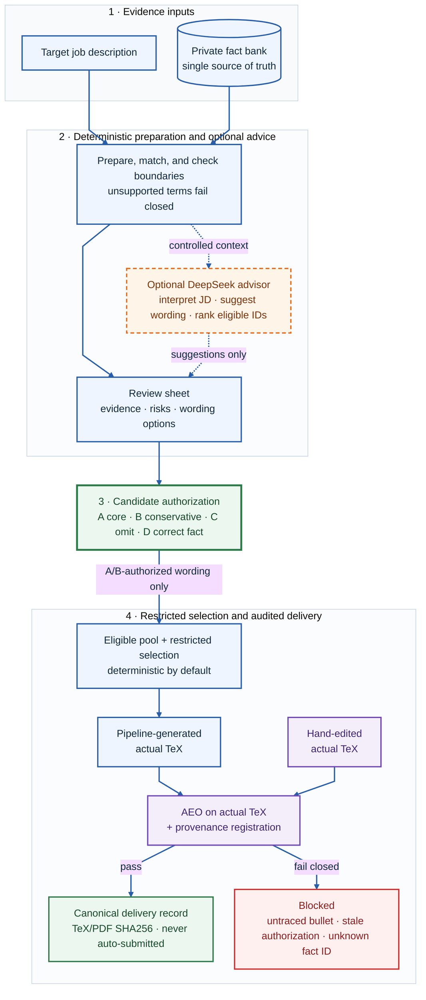

# Truthful Resume Agent

[English](README.md) | [简体中文](README.zh-CN.md)

[](https://github.com/123xpw/truthful-resume-agent/actions/workflows/ci.yml)
[](LICENSE)

**A local engineering prototype for keeping resume assistance inside explicit,
traceable fact boundaries.**

DeepSeek may interpret the JD, rank already-authorized material, and suggest
revisions. Deterministic checks protect the facts and delivery path; the
candidate remains the only wording authority.

> **Current maturity:** the CLI is an independently usable local MVP. The Web
> UI is a diagnostics dashboard, not yet a complete replacement for the CLI.
> The system intentionally cannot approve resume claims on the candidate's
> behalf.

The project began as a personal campus-recruiting tool: repeatedly pasting the
same experience history into model conversations was wasteful, while model
memory and factual restraint were unreliable. It does not claim to predict
screening outcomes or improve resume pass rates. Its narrower question is how
to make evidence, state, and failure visible when an LLM explains private
career facts.

## The Control Model

| AI advises | Code constrains | Candidate authorizes |
| --- | --- | --- |
| Interpret the JD, surface red flags, suggest review-only wording, rank eligible fragment IDs | Validate sources, block unsupported terms, enforce hashes, restrict selection, audit provenance | Approve exact A/B wording, confirm manual bullet provenance, decide whether to submit |

The project deliberately separates evidence, wording authorization, JD fit,
and delivery. No prompt is allowed to collapse those decisions into one model
response.

### Why an Agent and why LangGraph?

The fixed `prepare -> authorize -> finalize -> deliver` pipeline does not need
an Agent. The Agent exists only for open-ended, multi-turn fact questions where
the user may ask for more evidence or a repaired answer. LangChain supplies
replaceable message/model/tool adapters. LangGraph makes the
`retrieve -> generate -> verify -> reflect` state, conditional repair loop,
checkpoint, and node trace explicit; this small graph could also be written as
a plain Python state machine. Framework choice is an implementation trade-off,
not the product value or a production-readiness claim.

## Five-Minute Start — No API Key

Requirements: Python 3.11+.

```bash
git clone https://github.com/123xpw/truthful-resume-agent.git
cd truthful-resume-agent
python3 -m venv .venv
.venv/bin/python -m pip install -r requirements.txt

.venv/bin/python backend/run_cli.py validate
.venv/bin/python backend/run_cli.py explain-jd \
  --file data/sample_jds/alibaba_ai_agent_engineer.md \
  --no-llm --write
```

A clean clone automatically falls back to `*.example.json`; neither private
data nor an API key is required. The desensitized report is written to
`data/outputs/alibaba_ai_agent_engineer/jd_insight.html`.

> **Demo:** [open the published JD Insight artifact](https://123xpw.github.io/truthful-resume-agent/)
> to inspect deterministic fact matches and unsupported-term guardrails. It
> demonstrates one analysis output, not the entire workflow.

## How It Works



There are two supported delivery routes:

- **Pipeline-generated resume:** `prepare -> authorize -> finalize -> deliver`.
- **Hand-edited canonical resume:** run `aeo-review`, then
  `register-canonical` against the actual TeX and PDF. Every professional bullet
  must match a current authorization or have candidate-confirmed provenance.

## What Works Today

- **Evidence control:** structured private facts, explicit boundaries,
  source-linked A/B wording, unsupported-term blocking, and keyword retrieval
  with optional semantic recall.
- **Authorization control:** content-bound decisions are reused only while the
  wording remains unchanged; stale facts or bullets return to pending.
- **Selection and delivery:** the full authorized inventory is considered,
  capacity and omission reasons remain explicit, and every delivered
  professional bullet must pass provenance checks.
- **Analysis and learning:** AEO review, a read-only LangGraph fact Q&A Agent,
  a local zero-LLM application outcome dashboard, interview feedback, mastery
  history, and cross-JD gap trends.

## Read-only Agent API

FastAPI exposes the fact Q&A Agent without granting it fact, authorization, or
delivery writes:

```bash
.venv/bin/uvicorn backend.resume_agent.web.app:app --reload

curl -X POST http://127.0.0.1:8000/api/v1/conversations
curl -X POST http://127.0.0.1:8000/api/v1/conversations/CONVERSATION_ID/messages \
  -H 'Content-Type: application/json' \
  -d '{"message":"Which facts support Python API work?"}'
```

Each response returns a `trace_id`, verification status, and the LangGraph
nodes traversed. Conversation state is isolated by UUID and persisted in a
local SQLite checkpointer; node traces store IDs, timing, status, and evidence
fact IDs, never raw chat, JD, or resume text. Checkpoint tables do contain the
messages and retrieved evidence needed to resume a conversation, so the whole
runtime database must be handled as private data.

| Failure | Behavior |
| --- | --- |
| LLM timeout, 429, or provider 5xx | At most two bounded retries, then a structured 503/504 error |
| Missing or rejected LLM credentials | Immediate structured 503; deterministic CLI features remain available |
| Fact tool failure | Fail closed before generation |
| Semantic retrieval failure in `/api/analyze` | Explicit keyword fallback with `degraded=true`, unless fallback is disabled |
| Verifier failure after three reflections | HTTP 200 with `status=blocked`; the draft is not presented as verified |

This remains a local single-user API. A conversation ID separates state but is
not authentication or authorization.

## Full Delivery Workflow

### 1. Prepare, authorize, and finalize

```bash
.venv/bin/python backend/run_cli.py prepare \
  --file data/sample_jds/tencent_ai_application.md \
  --name demo_tencent

# Requires a real interactive terminal. Only new or changed wording is asked.
.venv/bin/python backend/run_cli.py authorize --name demo_tencent

# Deterministic selection is the default and needs no LLM key.
.venv/bin/python backend/run_cli.py finalize --name demo_tencent
.venv/bin/python backend/run_cli.py status --name demo_tencent
```

`authorize` shows complete wording alternatives:

| Choice | Meaning | Eligible for selection |
| --- | --- | :---: |
| `A` | Authorize the core wording | Yes |
| `B` | Authorize only the conservative wording | Yes |
| `C` | Keep the fact off resumes for now | No |
| `D` | Correct the underlying fact | No |

The legacy command name `decide` remains an alias. A/B grants permission to use
the exact wording; it does not force that experience into every resume.

Use `finalize --llm-select` only after configuring an LLM. The model can return
existing eligible fragment IDs, but unknown, duplicate, wrong-section, or
over-capacity IDs fail closed. Model prose never enters the generated resume.

### 2. Audit the artifact that will actually be sent

For a generated or manually edited TeX resume:

```bash
.venv/bin/python backend/run_cli.py aeo-review \
  --name demo_tencent \
  --resume data/outputs/demo_tencent/resume_draft.tex \
  --no-llm --write

.venv/bin/python backend/run_cli.py register-canonical \
  --name demo_tencent \
  --tex data/outputs/demo_tencent/resume_draft.tex \
  --pdf data/outputs/demo_tencent/resume_draft.pdf
```

`register-canonical` blocks delivery when a professional bullet lacks a current
authorized fragment or candidate-confirmed manual provenance. It records both
the TeX and actual PDF SHA256 hashes when ready.

## Configuration

<details>
<summary><strong>Use private data</strong></summary>

Copy the ignored private-runtime files from the public examples:

```bash
cp data/facts/facts.example.json data/facts/facts.json
cp data/resume_fragments/fragments.example.json data/resume_fragments/fragments.json
cp data/profile/profile.example.json data/profile/profile.private.json
```

Edit only the private copies; they are excluded by `.gitignore`. Each fact
needs a stable ID, factual summary, retrieval keywords, explicit boundaries,
and a risk level. Each fragment cites one or more `source_fact_ids` and contains
complete A/B wording.

</details>

<details>
<summary><strong>Enable optional DeepSeek assistance</strong></summary>

The LLM client uses an OpenAI-compatible Chat Completions endpoint. DeepSeek is
the default; the URL and model remain configurable.

```bash
cp .env.example .env
```

```dotenv
RESUME_AGENT_LLM_API_KEY=your-key
RESUME_AGENT_LLM_API_URL=https://api.deepseek.com/chat/completions
RESUME_AGENT_LLM_MODEL=deepseek-chat
RESUME_AGENT_LLM_TIMEOUT_SECONDS=30
RESUME_AGENT_LLM_MAX_RETRIES=2
RESUME_AGENT_WORKFLOW_TIMEOUT_SECONDS=90
```

Docker starts without an LLM key by default. To opt in, copy the ignored
override before `docker compose up --build`:

```bash
cp compose.override.example.yaml compose.override.yaml
```

LLM output is advisory. It may help revise the resume, but it cannot update
facts, authorization records, provenance confirmations, or delivered files.
`.env` is ignored and API keys are not written into reports.

</details>

> **Data boundary:** enabling an LLM may send the JD, retrieved fact summaries
and boundaries, chat content, or resume text to the configured provider. The
tool does not automatically redact those inputs. Use `--no-llm` and the default
deterministic selector when the data must stay fully local.

## Optional read-only Feishu application ledger

The Web UI treats a Feishu spreadsheet as the operational application ledger and keeps versioned local snapshots for deterministic decision support. The integration is read-only, makes zero LLM calls, and deduplicates unchanged content.

Create an internal Feishu app with spreadsheet read permission, grant that app access to the target document, and place the following values only in the ignored local `.env`:

```dotenv
RESUME_AGENT_FEISHU_SPREADSHEET_URL=https://example.feishu.cn/sheets/REPLACE_ME
RESUME_AGENT_FEISHU_APP_ID=
RESUME_AGENT_FEISHU_APP_SECRET=
RESUME_AGENT_FEISHU_SHEET_ID=
RESUME_AGENT_FEISHU_RANGE=A1:Z500
RESUME_AGENT_FEISHU_TIMEOUT_SECONDS=10
```

The page renders the last local snapshot immediately and then performs one background read-only sync; failure preserves the last successful dashboard. The local database stores normalized snapshots, source revisions, and sync timestamps, but never the App Secret or `tenant_access_token`. The main UI is a single application cockpit: four current metrics, stage distribution, priority-by-stage bars, and at most five deterministic focus items. Full row detail stays in Feishu. Legacy outcome and local resume-link APIs remain available for compatibility/experimentation but are not shown in the daily UI. Feishu remains authoritative.

## Evaluation

The matcher report is based on a complete 4-JD x 11-fact audit matrix:

| Matcher | Macro useful recall | Macro useful precision | Decision |
| --- | ---: | ---: | --- |
| Keyword | 80% | 64% | Conservative default |
| Semantic | 88% | 56% | Optional recall path |

Semantic retrieval improves recall but reduces precision and selects one
irrelevant fact in the data-role sample. It therefore remains opt-in and never
decides which experience exists. See
[`data/evaluation/matcher_report.md`](data/evaluation/matcher_report.md).

The retrieval regression suite runs 10 fixed queries through both the keyword
baseline and the actual embedded-Qdrant `query_points` path. On the current
desensitized facts, keyword Recall@5 is 0.50; Qdrant semantic Recall@5 is 1.00
and MRR is 0.80. The small set is a regression fixture, not a production
benchmark or resume claim.

A separate private single-run decision experiment compared full structured
fact context with the Agent's keyword top-5 context over five diverse target
JDs and 11 facts. Full context recovered 29/31 useful labels (93.5%) versus
14/31 (45.2%) for keyword top-5, with nearly identical useful precision
(70.7% versus 70.0%). Its average prompt was about twice as long (14.5k versus
7.4k characters) and slower in that run (6.2s versus 3.8s). This supports full
context as the current small-bank baseline, not unrestricted model selection:
the model selected more marginal material and still requires deterministic
boundaries. Private JDs, facts, prompts, and outputs remain outside Git. This is
a decision aid, not a statistical benchmark or pass-rate result.

The Agent suite adds 24 fixed scenarios covering supported and unsupported
queries, verifier repair, malformed verifier output, and bounded fail-closed
routing. Runtime/API tests separately cover SQLite persistence, cross-session
isolation, retries, dependency failures, trace privacy, and HTTP contracts.

Before an interview, run the scripted-provider demo to inspect a successful
answer, verifier-exhaustion block, and structured LLM-timeout error without an
API key:

```bash
.venv/bin/python -m backend.resume_agent.agent_demo
```

It demonstrates Agent orchestration and failure boundaries, not model quality.

<details>
<summary><strong>Run the evaluation commands</strong></summary>

```bash
.venv/bin/python -m backend.resume_agent.eval_matchers
.venv/bin/python -m backend.resume_agent.rag_eval
.venv/bin/python -m backend.resume_agent.agent_eval
```

</details>

## Command Reference

| Stage | Commands |
| --- | --- |
| Understand | `analyze`, `explain-jd`, `gap-check`, `career-trends` |
| Authorize | `prepare`, `authorize`, `expand-review` |
| Generate | `finalize`, `status`, `list`, `deliver` |
| Audit | `aeo-review`, `register-canonical` |
| Learn from outcomes | `record-outcome`, `record-interview`, `list-interview`, `mastery-history` |

Run `.venv/bin/python backend/run_cli.py --help` for every option.

## Verification and Privacy

<details>
<summary><strong>Run the verification suite</strong></summary>

```bash
.venv/bin/python backend/run_cli.py validate
.venv/bin/python -m backend.resume_agent.smoke_test
.venv/bin/python -m backend.resume_agent.agent.test_agent
.venv/bin/python -m backend.resume_agent.agent.test_runtime
.venv/bin/python -m backend.resume_agent.test_outcomes
.venv/bin/python -m backend.resume_agent.test_feishu_sync
.venv/bin/python -m backend.resume_agent.test_feishu_links
.venv/bin/python -m backend.resume_agent.agent_eval
.venv/bin/python -m backend.resume_agent.eval_matchers
.venv/bin/python -m backend.resume_agent.rag_eval
.venv/bin/pip check
```

</details>

The smoke suite runs with both private-runtime filenames and public
`*.example.json` fallback data. It covers pending/stale review rejection, TTY
gating, content-bound authorization reuse, matcher-independent inventory,
unsupported-term blocking, canonical provenance, actual PDF hashes, Web import,
and Agent verifier failure paths.

The public repository contains only desensitized examples and public sample
JDs. Private facts, fragments, profile, JD library, outputs, vector index,
authorizations, outcomes, memory, and `.env` are ignored. A clean public Git
history is still required because `.gitignore` cannot remove secrets from old
commits.

## Known Limitations

- This is a local, single-user workflow without authentication, multi-user
  serving, production monitoring, or transactional database guarantees.
  SQLite persistence and structured traces are intended for local/lightweight
  use; they are not a substitute for a multi-user database and retention policy.
- `aeo-review` currently reads TeX source, not text extracted from the final
  PDF. `register-canonical` hashes the PDF but does not validate ATS extraction
  order or layout readability.
- The TTY requirement is a friction barrier, not cryptographic proof that a
  human supplied the authorization.
- The Agent verifier is an LLM judgment over an evidence bundle, not formal
  entailment proof; malformed verifier output fails closed.
- Retrieval metrics come from a small, attributed 4-JD x 11-fact matrix and
  should not be generalized as a production benchmark.

## Web UI and Documentation

```bash
.venv/bin/uvicorn backend.resume_agent.web.app:app --reload
# Or start the public-example configuration:
docker compose up --build
```

On macOS, after the local environment is installed, double-click
`启动投递看板.command`. The launcher safely replaces its own stale process and
enables local code reload so a new page cannot silently talk to an old API. Use
`停止投递看板.command` to stop its background server.

Open <http://127.0.0.1:8000> for the optional personal application cockpit;
it is an operations extension rather than the core Agent workflow. It verifies
the API contract, renders the last successful Feishu snapshot immediately, and
then performs one background read. The daily page does not reproduce the
source table, local outcome entry, PDF links, or experimental timelines. Its
separate [job-analysis page](http://127.0.0.1:8000/job-analysis) builds a
per-requirement evidence matrix: every positive match cites a fact ID and
boundaries, while unsupported technologies fail closed. Previewed JD text is
not saved and the endpoint makes zero LLM calls. The static
[project-review page](http://127.0.0.1:8000/project-review) records the origin,
framework trade-offs, context experiment, engineering lessons, and interview
boundaries without exposing private inputs. Open <http://127.0.0.1:8000/docs>
for the API contract. Docker
excludes private runtime files from the image context;
the base Compose service receives no key, while the optional ignored override
injects one at runtime. Named volumes persist checkpoints, outcome events, and indexes.
Authorization, finalization, AEO, and canonical registration remain CLI
operations in the current MVP.

Compatibility outcome APIs keep state in a local SQLite database and can import
the ignored legacy `application_outcomes.json` once without modifying it.
Backup, restore, archive, and export remain available through the API but are
not shown in the daily cockpit. Database files, backups, PDFs, and legacy
outcome JSON stay outside Git and the public Docker image.

Design details are in [`docs/technical_design.md`](docs/technical_design.md),
[`docs/risk_policy.md`](docs/risk_policy.md), and
[`docs/evaluation_plan.md`](docs/evaluation_plan.md).

## License

Licensed under the [Apache License 2.0](LICENSE).
