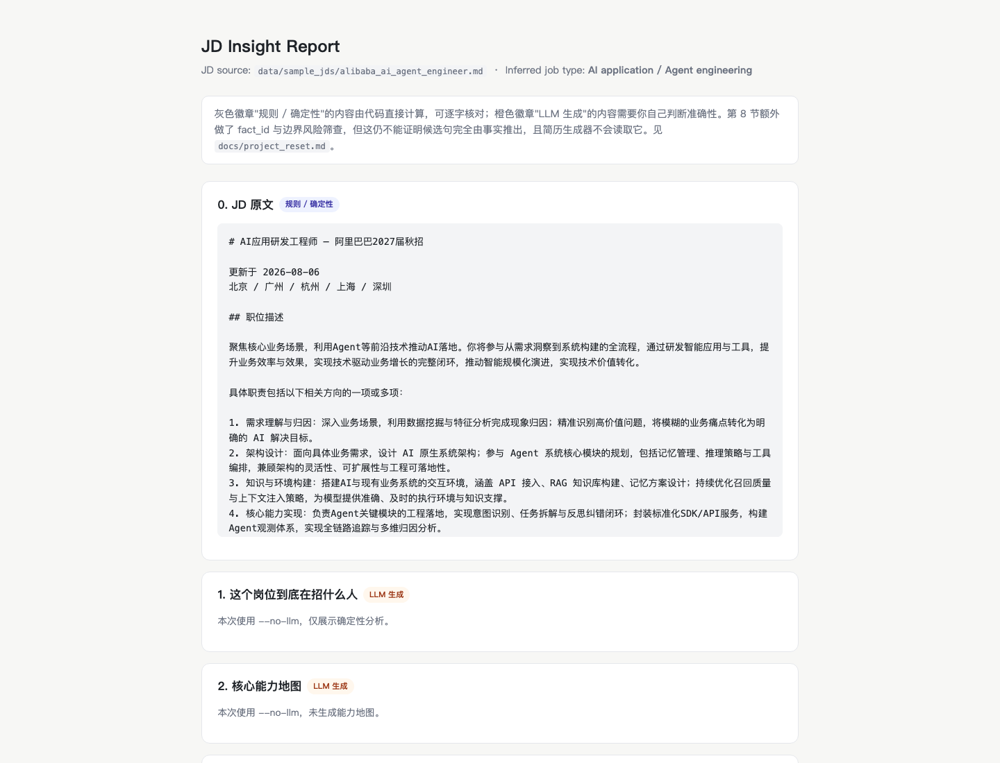

# Truthful Resume Agent

[English](README.md) | [简体中文](README.zh-CN.md)

An evidence-grounded CLI for understanding a job description, retrieving
relevant experience, and producing a review-gated resume draft.

It is not a generic "make my resume sound stronger" generator. Most AI
resume tools help you polish claims; this one works the other way. The fact
bank is the single source of truth, the LLM is forbidden from writing resume
wording, and every sentence is manually confirmed and traceable to a source
fact. The system separates three questions:

1. What does this JD require?
2. Which recorded experiences support those requirements?
3. Which exact wording is defensible, and which eligible items should the agent select for this JD and page budget?

[Live desensitized JD Insight demo](https://123xpw.github.io/truthful-resume-agent/)



## What It Does

- Parses public JD text into responsibilities, hard requirements, and bonus items.
- Matches a structured fact bank with keyword search and optional Qdrant vector retrieval.
- Blocks unsupported technologies until the fact bank contains evidence for them.
- Shows the exact core and conservative resume wording before confirmation.
- Rejects pending or hand-edited decisions during resume generation.
- Produces Markdown/HTML reports and a LaTeX resume draft.
- Records observed application outcomes against the generated PDF hash.
- Ships a LangChain + LangGraph conversational agent with tool calling,
  a retrieve → generate → verify → reflect loop, and short-term (checkpoint)
  plus long-term (JSON) memory.

The optional LLM path helps explain the JD and generate review-only interview
questions or wording candidates. LLM output cannot update facts, confirmation
records, or resume files.

## Five-Minute Start

Requirements: Python 3.11+.

```bash
git clone https://github.com/123xpw/truthful-resume-agent.git
cd truthful-resume-agent
python3 -m venv .venv
.venv/bin/python -m pip install -r requirements.txt
```

Run the public sample without an API key:

```bash
.venv/bin/python backend/run_cli.py validate
.venv/bin/python backend/run_cli.py analyze \
  --file data/sample_jds/alibaba_ai_agent_engineer.md \
  --name demo_alibaba
.venv/bin/python backend/run_cli.py explain-jd \
  --file data/sample_jds/alibaba_ai_agent_engineer.md \
  --no-llm --write
```

The report is written to:

```text
data/outputs/alibaba_ai_agent_engineer/jd_insight.html
```

The clean clone automatically uses desensitized `*.example.json` data. No
private profile or API key is needed for this path.

## Full Resume Workflow

```bash
.venv/bin/python backend/run_cli.py prepare \
  --file data/sample_jds/tencent_ai_application.md \
  --name demo_tencent

.venv/bin/python backend/run_cli.py decide --name demo_tencent
.venv/bin/python backend/run_cli.py finalize --name demo_tencent --llm-select
.venv/bin/python backend/run_cli.py status --name demo_tencent
```

`decide` is a one-time resume-wording authorization step, not an interview
readiness test. Each new or changed experience shows two complete alternatives:

- `A`: the core wording is factually accurate; authorize it for resumes.
- `B`: only the conservative wording is accurate; authorize that version.
- `C`: the fact is broadly accurate, but keep it off resumes for now.
- `D`: the underlying fact needs correction.

A/B confirms factual accuracy and permission to use the wording, not editorial selection.
`finalize` selects at most three internships and two projects and writes
`selection_plan.md`. With `--llm-select`, the model may return only existing
fragment IDs; unknown, duplicate, wrong-section, or over-capacity IDs fail
closed, and model prose never enters the resume.

The authorization is stored locally in `data/resume_authorizations.json` and
reused across applications when the exact fact and fragment content hash is
unchanged. A new JD therefore normally skips `decide` for wording already
authorized. If a fact or bullet changes, only the affected item becomes pending
again. Interview preparation and free-text notes remain optional.

`decide` requires a TTY and rejects piped stdin. This is a friction barrier,
not cryptographic proof that a human typed the answer. Resume generation also
checks for pending decisions, interactive confirmation markers, and stale
artifacts. If the JD, fact bank, or resume fragments change after review,
`prepare` rebuilds the review, automatically reapplies unchanged content-hash
authorizations, and asks only about new or changed wording.

To compile the generated TeX, install XeLaTeX/latexmk or Tectonic. When only
Tectonic is available, run the command printed by `finalize`.

## Use Your Own Data

Copy the public examples to private runtime files:

```bash
cp data/facts/facts.example.json data/facts/facts.json
cp data/resume_fragments/fragments.example.json data/resume_fragments/fragments.json
cp data/profile/profile.example.json data/profile/profile.private.json
```

Then edit the private copies. They are excluded by `.gitignore`.

Each fact should contain:

- a stable `id`
- a factual summary
- retrieval keywords
- explicit boundaries
- a risk level

Each resume fragment cites one or more `source_fact_ids` and contains complete
`A` and `B` bullet sets. Run validation after editing:

```bash
.venv/bin/python backend/run_cli.py validate
```

## Optional LLM Configuration

The client uses an OpenAI-compatible chat-completions endpoint. DeepSeek is the
default, but URL and model are configurable.

```bash
cp .env.example .env
```

Set these values in `.env`:

```dotenv
RESUME_AGENT_LLM_API_KEY=your-key
RESUME_AGENT_LLM_API_URL=https://api.deepseek.com/chat/completions
RESUME_AGENT_LLM_MODEL=deepseek-chat
```

API keys are never included in generated reports and `.env` is ignored.

## Architecture

```text
Public JD
   |
   +--> deterministic requirement extraction
   |
   +--> keyword matcher
   |       |
   |       +--> unsupported-term evidence gate
   |
   +--> optional fastembed + embedded Qdrant candidates
           |
           +--> candidate review only

Matched fact IDs
   --> source-linked A/B fragments
   --> candidate truth/explainability confirmation
   --> restricted 3-internship/3-project selection plan
   --> included/omitted report
   --> stale/pending/confirmation checks
   --> LaTeX resume draft
```

Trusted resume wording remains deterministic and source-linked. Optional LLM
selection ranks only confirmed fragment IDs and cannot generate or rewrite a
resume sentence. Experimental LLM wording remains review-only.

## Evaluated Retrieval, Not a Vector-Database Claim

The repository includes an attributed audit baseline in
`data/evaluation/matcher_labels.json` and a generated comparison report in
`data/evaluation/matcher_report.md`.

Current result: semantic retrieval did not improve useful-fact recall across
the four sample JDs and selected one irrelevant fact for the data-role sample.
Qdrant therefore remains an auxiliary recall path rather than the automatic
resume selector. This limitation is intentional and visible.

Re-run the evaluation:

```bash
.venv/bin/python -m backend.resume_agent.eval_matchers
.venv/bin/python -m backend.resume_agent.rag_eval   # Recall@K and MRR
```

## Main Commands

| Command | Purpose |
| --- | --- |
| `validate` | Validate facts, fragments, profile, and source links |
| `analyze` | Match a JD and write a deterministic report |
| `explain-jd` | Generate the checkable JD Insight Markdown/HTML report |
| `prepare` | Save a JD and create its report/review sheet |
| `decide` | Confirm the truthfulness/explainability boundary of exact A/B wording |
| `finalize` | Write a selection report and generate TeX; optional `--llm-select` |
| `status` / `list` | Show pending, stale, draft, and export-ready states |
| `gaps` / `expand-review` | Inspect missing resume coverage without auto-promoting facts |
| `gap-check` | Warn about missing evidence for a single JD (terminal + HTML) |
| `career-trends` | Aggregate missing-tech gaps across JDs and flag repeated ones |
| `record-outcome` | Record an observed application state and PDF hash |
| `record-interview` | Record interview feedback and optionally append to fact boundaries |
| `list-interview` | List recorded interview feedback for an application |
| `mastery-history` | Show mastery progression (C->B->A) across decide snapshots |

Run `python3 backend/run_cli.py --help` for all options.

## Privacy Model

The public repository contains only desensitized examples and public sample
JDs. These runtime paths are intentionally ignored:

- `data/facts/facts.json`
- `data/resume_fragments/fragments.json`
- `data/profile/profile.private.json`
- `data/jd_library/`
- `data/outputs/`
- `data/semantic_index/`
- `data/application_outcomes.json`
- `.env`

Do not publish an existing personal repository history merely after adding
`.gitignore`; old commits may still contain removed private files. Create a
clean public history, as this repository does.

## Verification

```bash
.venv/bin/python backend/run_cli.py validate
.venv/bin/python -m backend.resume_agent.smoke_test
.venv/bin/python -m backend.resume_agent.eval_matchers
```

The smoke suite covers pending-review rejection, TTY gating, EOF recovery,
composite facts, stale review/artifact detection, semantic-candidate isolation,
unsupported-term blocking, outcome hashes, and delivery gates.

Design details and tradeoffs are in `docs/technical_design.md`,
`docs/risk_policy.md`, and `docs/evaluation_plan.md`.

## Web UI (Optional)

A FastAPI web interface wraps the CLI capabilities into a single-page UI:

```bash
.venv/bin/uvicorn backend.resume_agent.web.app:app --reload
```

Open http://127.0.0.1:8000 for JD analysis, application list, gap trends,
mastery timeline, and interview feedback recording.
