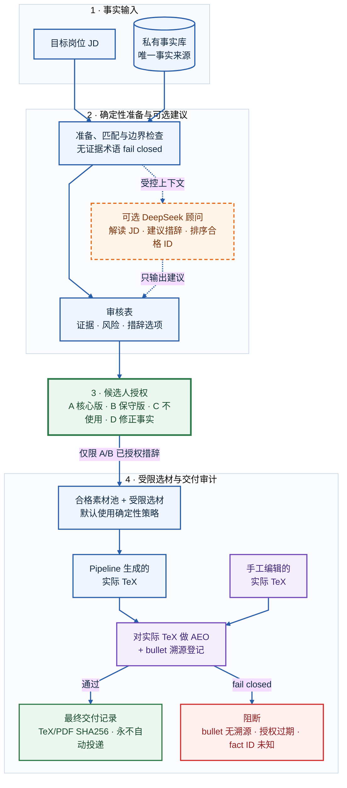

# Truthful Resume Agent

[English](README.md) | [简体中文](README.zh-CN.md)

[](https://github.com/123xpw/truthful-resume-agent/actions/workflows/ci.yml)
[](LICENSE)

**一套基于事实证据的本地流程，用于把岗位描述（JD）转化为可辩护、可溯源的简历。**

DeepSeek 可以解读 JD、排序已授权素材并提出修改建议；确定性代码保护事实和交付路径，候选人始终是唯一的措辞授权者。

> **当前成熟度：**CLI 已是可独立使用的本地 MVP；Web 目前是诊断看板，还不能完整替代 CLI。系统刻意不允许 Agent 代替候选人批准简历声明。

## 控制模型

| AI 提建议 | 代码做约束 | 候选人做授权 |
| --- | --- | --- |
| 解读 JD、暴露 red flag、提出只供审阅的措辞、排序合格 fragment ID | 校验来源、阻断无证据术语、执行哈希门禁、限制选材、审计溯源 | 批准准确的 A/B 措辞、确认手工 bullet 溯源、决定是否投递 |

系统刻意把事实证据、措辞授权、JD 适配和最终交付拆开，不允许一个 prompt 把这些决定合并成一次模型输出。

## 五分钟开始：无需 API Key

环境要求：Python 3.11+。

```bash
git clone https://github.com/123xpw/truthful-resume-agent.git
cd truthful-resume-agent
python3 -m venv .venv
.venv/bin/python -m pip install -r requirements.txt

.venv/bin/python backend/run_cli.py validate
.venv/bin/python backend/run_cli.py explain-jd \
  --file data/sample_jds/alibaba_ai_agent_engineer.md \
  --no-llm --write
```

干净克隆会自动回退到 `*.example.json`，不需要私人数据或 API Key。脱敏报告会写入 `data/outputs/alibaba_ai_agent_engineer/jd_insight.html`。

> **在线样例：**[查看已发布的 JD Insight 产物](https://123xpw.github.io/truthful-resume-agent/)，了解确定性事实匹配和无证据术语阻断。它只展示一种分析产物，不代表完整流程。

## 工作流程



系统支持两条交付路线：

- **Pipeline 生成简历：**`prepare -> authorize -> finalize -> deliver`。
- **手工编辑最终简历：**对实际 TeX 运行 `aeo-review`，再用 `register-canonical` 审计真实 TeX/PDF。每条专业经历 bullet 必须匹配当前授权，或具有候选人确认的溯源。

## 当前已实现

- **事实控制：**私有结构化事实、明确边界、来源绑定 A/B 措辞、无证据术语阻断，以及默认关键词检索和可选语义召回。
- **授权控制：**只有内容未变化时才复用历史决定；事实或 bullet 变化后会自动回到待确认。
- **选材与交付：**始终考虑完整已授权素材池，明确报告容量和遗漏原因，并对最终专业 bullet 逐条做溯源检查。
- **分析与学习：**AEO 检查、只读 LangGraph 事实问答 Agent、投递结果、面试反馈、mastery 历史和跨 JD 缺口趋势。

## 完整交付流程

### 1. 准备、授权与生成

```bash
.venv/bin/python backend/run_cli.py prepare \
  --file data/sample_jds/tencent_ai_application.md \
  --name demo_tencent

# 需要真实交互式终端，只询问新增或内容变更项。
.venv/bin/python backend/run_cli.py authorize --name demo_tencent

# 默认为确定性选材，无需 LLM Key。
.venv/bin/python backend/run_cli.py finalize --name demo_tencent
.venv/bin/python backend/run_cli.py status --name demo_tencent
```

`authorize` 会展示完整措辞选项：

| 选项 | 含义 | 可进入选材池 |
| --- | --- | :---: |
| `A` | 授权核心版措辞 | 是 |
| `B` | 只授权保守版措辞 | 是 |
| `C` | 当前不进入简历 | 否 |
| `D` | 修正底层事实 | 否 |

旧命令名 `decide` 仍作为兼容别名。A/B 代表允许使用该完整措辞，不代表每份简历都必须选入该经历。

只有配置 LLM 后才应使用 `finalize --llm-select`。模型只能返回已有且合格的 fragment ID；陌生、重复、栏目错误或超出容量的 ID 都会 fail-closed，模型文本不会进入生成简历。

### 2. 审计实际要投递的产物

```bash
.venv/bin/python backend/run_cli.py aeo-review \
  --name demo_tencent \
  --resume data/outputs/demo_tencent/resume_draft.tex \
  --no-llm --write

.venv/bin/python backend/run_cli.py register-canonical \
  --name demo_tencent \
  --tex data/outputs/demo_tencent/resume_draft.tex \
  --pdf data/outputs/demo_tencent/resume_draft.pdf
```

如果专业经历 bullet 没有当前有效授权，也没有候选人确认的手工溯源，`register-canonical` 会阻断登记。通过后会记录真实 TeX 和 PDF 的 SHA256。

## 配置

<details>
<summary><strong>使用私有数据</strong></summary>

从公开样例复制被忽略的私有运行文件：

```bash
cp data/facts/facts.example.json data/facts/facts.json
cp data/resume_fragments/fragments.example.json data/resume_fragments/fragments.json
cp data/profile/profile.example.json data/profile/profile.private.json
```

只编辑私有副本，它们已被 `.gitignore` 排除。每条 fact 需要稳定 ID、事实摘要、检索关键词、明确边界和风险等级；每个 fragment 需引用一个或多个 `source_fact_ids`，并提供完整 A/B 措辞。

</details>

<details>
<summary><strong>启用可选 DeepSeek 辅助</strong></summary>

LLM 客户端使用 OpenAI-compatible Chat Completions 接口。默认为 DeepSeek，URL 和模型可配置。

```bash
cp .env.example .env
```

```dotenv
RESUME_AGENT_LLM_API_KEY=your-key
RESUME_AGENT_LLM_API_URL=https://api.deepseek.com/chat/completions
RESUME_AGENT_LLM_MODEL=deepseek-chat
```

LLM 输出只是建议。它可以辅助修改简历，但不能更新事实、授权记录、溯源确认或投递文件。`.env` 已被忽略，API Key 也不会写入报告。

</details>

> **数据边界：**启用 LLM 后，JD、召回的事实摘要与边界、对话内容或简历文本可能发送给所配置的模型服务商。系统不会自动脱敏这些输入。需要完全本地处理时，请使用 `--no-llm` 和默认确定性选材。

## 评测

当前匹配器报告基于完整的 4 JD x 11 facts 审计矩阵：

| Matcher | 宏平均有效召回率 | 宏平均有效精度 | 定位 |
| --- | ---: | ---: | --- |
| Keyword | 80% | 64% | 保守默认 |
| Semantic | 88% | 56% | 可选辅助召回 |

语义检索提高了召回率，但降低了精度，并在数据岗样例中选中一条无关事实。因此它继续保持 opt-in，且不能决定某段经历是否存在。详见 [`data/evaluation/matcher_report.md`](data/evaluation/matcher_report.md)。

`rag_eval` 只是 5 条查询的 sanity check，不是生产级评测，也不作为简历成绩。

<details>
<summary><strong>运行评测命令</strong></summary>

```bash
.venv/bin/python -m backend.resume_agent.eval_matchers
.venv/bin/python -m backend.resume_agent.rag_eval
```

</details>

## 命令参考

| 阶段 | 命令 |
| --- | --- |
| 理解岗位 | `analyze`, `explain-jd`, `gap-check`, `career-trends` |
| 授权措辞 | `prepare`, `authorize`, `expand-review` |
| 生成简历 | `finalize`, `status`, `list`, `deliver` |
| 交付审计 | `aeo-review`, `register-canonical` |
| 反馈回流 | `record-outcome`, `record-interview`, `list-interview`, `mastery-history` |

运行 `.venv/bin/python backend/run_cli.py --help` 查看全部参数。

## 验证与隐私

<details>
<summary><strong>运行完整验证</strong></summary>

```bash
.venv/bin/python backend/run_cli.py validate
.venv/bin/python -m backend.resume_agent.smoke_test
.venv/bin/python -m backend.resume_agent.agent.test_agent
.venv/bin/python -m backend.resume_agent.eval_matchers
.venv/bin/pip check
```

</details>

Smoke 同时支持私有运行文件名和公开 `*.example.json` 回退数据，覆盖待确认/过期拒绝、TTY 门禁、内容绑定授权复用、匹配器无关完整经历池、无证据技术阻断、最终 bullet 溯源、实际 PDF 哈希、Web 导入和 Agent 校验失败路径。

公开仓库只包含脱敏样例和公开 JD。私有 facts、fragments、profile、JD 库、输出、向量索引、授权、投递结果、记忆与 `.env` 都会被忽略。但 `.gitignore` 不能从旧提交中删除密钥，因此仍必须使用干净的公开 Git 历史。

## 已知边界

- 当前是本地单用户流程，不包含鉴权、多用户服务、生产监控或数据库事务保证。
- `aeo-review` 当前读取 TeX 源码，而不是从最终 PDF 抽取的文本。`register-canonical` 会对 PDF 做哈希，但还不会校验 ATS 文本抽取顺序或版式可读性。
- TTY 限制只是增加自动化代答成本，不是候选人亲自授权的密码学证明。
- Agent verifier 是对证据包的 LLM 判断，不是形式化逻辑证明；校验输出格式异常时会 fail-closed。
- 检索指标来自小型且有明确来源的 4 JD x 11 facts 矩阵，不能泛化为生产级基准。

## Web UI 与设计文档

```bash
.venv/bin/uvicorn backend.resume_agent.web.app:app --reload
```

打开 <http://127.0.0.1:8000> 查看 JD 分析、申请状态、缺口趋势、mastery 历史和面试反馈。当前 MVP 的授权、最终生成、AEO 和最终简历登记仍使用 CLI。

设计细节见 [`docs/technical_design.md`](docs/technical_design.md)、[`docs/risk_policy.md`](docs/risk_policy.md) 和 [`docs/evaluation_plan.md`](docs/evaluation_plan.md)。

## License

本项目使用 [Apache License 2.0](LICENSE) 开源许可证。
