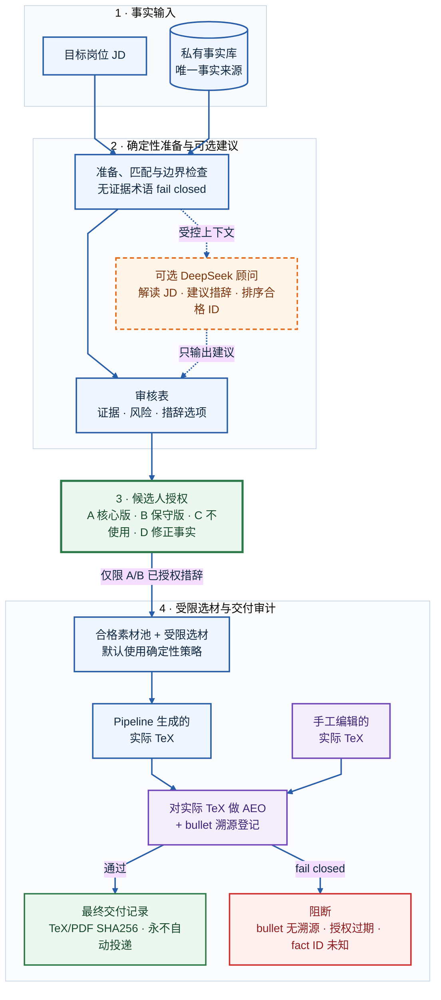

# Truthful Resume Agent

[English](README.md) | [简体中文](README.zh-CN.md)

[](https://github.com/123xpw/truthful-resume-agent/actions/workflows/ci.yml)
[](LICENSE)

**一个将简历辅助限制在明确、可溯源事实边界内的本地工程原型。**

DeepSeek 可以解读 JD、排序已授权素材并提出修改建议；确定性代码保护事实和交付路径，候选人始终是唯一的措辞授权者。

> **当前成熟度：** CLI 已是可独立使用的本地 MVP；Web 目前是诊断看板，还不能完整替代 CLI。系统刻意不允许 Agent 代替候选人批准简历声明。

项目起源于个人秋招：每次模型对话都重复粘贴同一份经历会浪费上下文，模型记忆和事实约束也不稳定。它不宣称预测筛选结果或提高简历通过率；项目收敛后的问题是：当 LLM 解释私人履历事实时，如何让证据、状态与失败可见。

## 控制模型

| AI 提建议 | 代码做约束 | 候选人做授权 |
| --- | --- | --- |
| 解读 JD、暴露 red flag、提出只供审阅的措辞、排序合格 fragment ID | 校验来源、阻断无证据术语、执行哈希门禁、限制选材、审计溯源 | 批准准确的 A/B 措辞、确认手工 bullet 溯源、决定是否投递 |

系统刻意把事实证据、措辞授权、JD 适配和最终交付拆开，不允许一个 prompt 把这些决定合并成一次模型输出。

### 为什么需要 Agent，为什么使用 LangGraph？

固定的 `prepare -> authorize -> finalize -> deliver` 不需要 Agent。Agent 只用于开放式、多轮的事实问答，用户可以继续追问证据或要求修复上一轮回答。LangChain 只提供可替换的消息、模型和工具适配；LangGraph 将 `retrieve -> generate -> verify -> reflect` 的状态、条件修复、checkpoint 和节点 trace 显式化。当前状态图规模不大，纯 Python 状态机也能完成；框架选择是实现取舍，不是项目价值或生产就绪证明。

## 五分钟开始：无需 API Key

环境要求：Python 3.11+。

```bash
git clone https://github.com/123xpw/truthful-resume-agent.git
cd truthful-resume-agent
python3 -m venv .venv
.venv/bin/python -m pip install -r requirements.txt

.venv/bin/python backend/run_cli.py validate
.venv/bin/python backend/run_cli.py explain-jd \
  --file data/sample_jds/alibaba_ai_agent_engineer.md \
  --no-llm --write
```

干净克隆会自动回退到 `*.example.json`，不需要私人数据或 API Key。脱敏报告会写入 `data/outputs/alibaba_ai_agent_engineer/jd_insight.html`。

> **在线样例：** [查看已发布的 JD Insight 产物](https://123xpw.github.io/truthful-resume-agent/)，了解确定性事实匹配和无证据术语阻断。它只展示一种分析产物，不代表完整流程。

## 工作流程



系统支持两条交付路线：

- **Pipeline 生成简历：** `prepare -> authorize -> finalize -> deliver`。
- **手工编辑最终简历：** 对实际 TeX 运行 `aeo-review`，再用 `register-canonical` 审计真实 TeX/PDF。每条专业经历 bullet 必须匹配当前授权，或具有候选人确认的溯源。

## 当前已实现

- **事实控制：** 私有结构化事实、明确边界、来源绑定 A/B 措辞、无证据术语阻断，以及默认关键词检索和可选语义召回。
- **授权控制：** 只有内容未变化时才复用历史决定；事实或 bullet 变化后会自动回到待确认。
- **选材与交付：** 始终考虑完整已授权素材池，明确报告容量和遗漏原因，并对最终专业 bullet 逐条做溯源检查。
- **分析与学习：** AEO 检查、只读 LangGraph 事实问答 Agent、零 LLM Token 的本地投递看板、面试反馈、mastery 历史和跨 JD 缺口趋势。

## 只读 Agent API

FastAPI 已暴露事实问答 Agent，但不授予事实、措辞授权或投递写权限：

```bash
.venv/bin/uvicorn backend.resume_agent.web.app:app --reload

curl -X POST http://127.0.0.1:8000/api/v1/conversations
curl -X POST http://127.0.0.1:8000/api/v1/conversations/CONVERSATION_ID/messages \
  -H 'Content-Type: application/json' \
  -d '{"message":"哪些事实能支撑 Python API 经历？"}'
```

响应会返回 `trace_id`、校验状态和实际经过的 LangGraph 节点。会话通过 UUID 隔离，并由本地 SQLite checkpointer 持久化。节点 trace 只保存 ID、耗时、状态和证据 fact ID，不保存完整对话、JD 或简历正文；但 checkpoint 表会保存恢复会话所需的消息和检索证据，因此整个 runtime 数据库必须按私密数据管理。

| 故障 | 系统行为 |
| --- | --- |
| LLM 超时、429 或服务端 5xx | 最多有界重试 2 次，之后返回结构化 503/504 |
| LLM Key 缺失或被拒绝 | 立即返回结构化 503，确定性 CLI 能力继续可用 |
| 事实工具异常 | 在生成前 fail-closed |
| `/api/analyze` 语义检索异常 | 显式回退关键词检索并返回 `degraded=true`，除非禁用回退 |
| verifier 经过 3 次反思仍失败 | HTTP 200 但 `status=blocked`，不把草稿冒充成已校验结果 |

它仍是本地单用户 API。`conversation_id` 只用于状态隔离，不等于身份认证或授权。

## 完整交付流程

### 1. 准备、授权与生成

```bash
.venv/bin/python backend/run_cli.py prepare \
  --file data/sample_jds/tencent_ai_application.md \
  --name demo_tencent

# 需要真实交互式终端，只询问新增或内容变更项。
.venv/bin/python backend/run_cli.py authorize --name demo_tencent

# 默认为确定性选材，无需 LLM Key。
.venv/bin/python backend/run_cli.py finalize --name demo_tencent
.venv/bin/python backend/run_cli.py status --name demo_tencent
```

`authorize` 会展示完整措辞选项：

| 选项 | 含义 | 可进入选材池 |
| --- | --- | :---: |
| `A` | 授权核心版措辞 | 是 |
| `B` | 只授权保守版措辞 | 是 |
| `C` | 当前不进入简历 | 否 |
| `D` | 修正底层事实 | 否 |

旧命令名 `decide` 仍作为兼容别名。A/B 代表允许使用该完整措辞，不代表每份简历都必须选入该经历。

只有配置 LLM 后才应使用 `finalize --llm-select`。模型只能返回已有且合格的 fragment ID；陌生、重复、栏目错误或超出容量的 ID 都会 fail-closed，模型文本不会进入生成简历。

### 2. 审计实际要投递的产物

```bash
.venv/bin/python backend/run_cli.py aeo-review \
  --name demo_tencent \
  --resume data/outputs/demo_tencent/resume_draft.tex \
  --no-llm --write

.venv/bin/python backend/run_cli.py register-canonical \
  --name demo_tencent \
  --tex data/outputs/demo_tencent/resume_draft.tex \
  --pdf data/outputs/demo_tencent/resume_draft.pdf
```

如果专业经历 bullet 没有当前有效授权，也没有候选人确认的手工溯源，`register-canonical` 会阻断登记。通过后会记录真实 TeX 和 PDF 的 SHA256。

## 配置

<details>
<summary><strong>使用私有数据</strong></summary>

从公开样例复制被忽略的私有运行文件：

```bash
cp data/facts/facts.example.json data/facts/facts.json
cp data/resume_fragments/fragments.example.json data/resume_fragments/fragments.json
cp data/profile/profile.example.json data/profile/profile.private.json
```

只编辑私有副本，它们已被 `.gitignore` 排除。每条 fact 需要稳定 ID、事实摘要、检索关键词、明确边界和风险等级；每个 fragment 需引用一个或多个 `source_fact_ids`，并提供完整 A/B 措辞。

</details>

<details>
<summary><strong>启用可选 DeepSeek 辅助</strong></summary>

LLM 客户端使用 OpenAI-compatible Chat Completions 接口。默认为 DeepSeek，URL 和模型可配置。

```bash
cp .env.example .env
```

```dotenv
RESUME_AGENT_LLM_API_KEY=your-key
RESUME_AGENT_LLM_API_URL=https://api.deepseek.com/chat/completions
RESUME_AGENT_LLM_MODEL=deepseek-chat
RESUME_AGENT_LLM_TIMEOUT_SECONDS=30
RESUME_AGENT_LLM_MAX_RETRIES=2
RESUME_AGENT_WORKFLOW_TIMEOUT_SECONDS=90
```

Docker 默认不接收 LLM Key。需要启用时，先复制被 Git 忽略的 override，再运行 `docker compose up --build`：

```bash
cp compose.override.example.yaml compose.override.yaml
```

LLM 输出只是建议。它可以辅助修改简历，但不能更新事实、授权记录、溯源确认或投递文件。`.env` 已被忽略，API Key 也不会写入报告。

</details>

> **数据边界：** 启用 LLM 后，JD、召回的事实摘要与边界、对话内容或简历文本可能发送给所配置的模型服务商。系统不会自动脱敏这些输入。需要完全本地处理时，请使用 `--no-llm` 和默认确定性选材。

## 飞书投递主台账（可选，只读）

Web 把飞书电子表格作为日常投递主台账，并将授权范围保存为本地版本化快照。当前实现只读取飞书，不回写单元格、不调用 LLM；相同内容不会重复创建快照。

先在飞书开放平台创建企业自建应用，只开通电子表格只读权限，并让该应用获得目标表格的协作者访问。随后把以下配置写入被 Git 忽略的本地 `.env`：

```dotenv
RESUME_AGENT_FEISHU_SPREADSHEET_URL=https://example.feishu.cn/sheets/REPLACE_ME
RESUME_AGENT_FEISHU_APP_ID=
RESUME_AGENT_FEISHU_APP_SECRET=
# 可留空，系统会选择第一个可见工作表。
RESUME_AGENT_FEISHU_SHEET_ID=
RESUME_AGENT_FEISHU_RANGE=A1:Z500
RESUME_AGENT_FEISHU_TIMEOUT_SECONDS=10
```

打开网页后会先展示最近一次本地快照，再在后台只读同步飞书；也可以手动刷新。同步失败不会清空上次成功数据。数据库只保存去除尾部空行/空列后的表格内容快照、来源版本和同步时间，不保存 App Secret 或 `tenant_access_token`。令牌只在当前服务进程的内存中复用，并在临近到期或被飞书拒绝时刷新；被拒绝后最多重试一次。

主页面是单一“求职投递分析”：显示进行中、笔试、高优先级进行中和待投递四项指标，以及状态分布、优先级×阶段和最多5条确定性“今日关注”。完整明细继续在飞书查看；网页不复制原表、不重复录入状态，也不展示本地申请/PDF关联和数据库维护控件。旧关联与 outcome API 暂时保留为实验/兼容能力，但不进入日常页面。飞书始终是投递状态的权威来源。

## 评测

当前匹配器报告基于完整的 4 JD x 11 facts 审计矩阵：

| Matcher | 宏平均有效召回率 | 宏平均有效精度 | 定位 |
| --- | ---: | ---: | --- |
| Keyword | 80% | 64% | 保守默认 |
| Semantic | 88% | 56% | 可选辅助召回 |

语义检索提高了召回率，但降低了精度，并在数据岗样例中选中一条无关事实。因此它继续保持 opt-in，且不能决定某段经历是否存在。详见 [`data/evaluation/matcher_report.md`](data/evaluation/matcher_report.md)。

检索回归集使用 10 条固定 query，同时运行 keyword baseline 和真实的 embedded-Qdrant `query_points` 路径。在当前脱敏事实上，keyword Recall@5 为 0.50，Qdrant semantic Recall@5 为 1.00、MRR 为 0.80。该小型数据集只是回归基线，不是生产 benchmark 或简历成绩。

另一组私有单次决策实验在 5 份不同方向的目标 JD、11 条事实上，对比完整结构化事实上下文与 Agent 实际使用的 keyword top-5。完整上下文找回 29/31 条 useful 标签（93.5%），keyword 为 14/31（45.2%）；有用精度几乎相同（70.7% 对 70.0%）。代价是平均提示长度约翻倍（1.45 万对 0.74 万字符），且该轮延迟更高（6.2 秒对 3.8 秒）。结果支持将完整上下文作为当前小事实库的基线，但不支持让模型不受限制地选材：模型会选入更多边缘素材，仍需确定性边界。私有 JD、事实、prompt 和输出全部保持在 Git 之外；这是方案选择证据，不是统计 benchmark 或通过率结论。

Agent 回归集包含 24 个固定场景，覆盖有证据/无证据问题、verifier 修正、非法 verifier 输出和有界 fail-closed 路由。独立 runtime/API 测试覆盖 SQLite 持久化、会话隔离、重试、依赖故障、trace 隐私和 HTTP 契约。

面试前可用无 API Key 的 scripted-provider 演示一次性查看成功回答、verifier 耗尽阻断和 LLM timeout 结构化错误：

```bash
.venv/bin/python -m backend.resume_agent.agent_demo
```

它演示的是 Agent 编排与故障边界，不是模型质量评测。

<details>
<summary><strong>运行评测命令</strong></summary>

```bash
.venv/bin/python -m backend.resume_agent.eval_matchers
.venv/bin/python -m backend.resume_agent.rag_eval
.venv/bin/python -m backend.resume_agent.agent_eval
```

</details>

## 命令参考

| 阶段 | 命令 |
| --- | --- |
| 理解岗位 | `analyze`, `explain-jd`, `gap-check`, `career-trends` |
| 授权措辞 | `prepare`, `authorize`, `expand-review` |
| 生成简历 | `finalize`, `status`, `list`, `deliver` |
| 交付审计 | `aeo-review`, `register-canonical` |
| 反馈回流 | `record-outcome`, `record-interview`, `list-interview`, `mastery-history` |

运行 `.venv/bin/python backend/run_cli.py --help` 查看全部参数。

## 验证与隐私

<details>
<summary><strong>运行完整验证</strong></summary>

```bash
.venv/bin/python backend/run_cli.py validate
.venv/bin/python -m backend.resume_agent.smoke_test
.venv/bin/python -m backend.resume_agent.agent.test_agent
.venv/bin/python -m backend.resume_agent.agent.test_runtime
.venv/bin/python -m backend.resume_agent.test_outcomes
.venv/bin/python -m backend.resume_agent.test_feishu_sync
.venv/bin/python -m backend.resume_agent.test_feishu_links
.venv/bin/python -m backend.resume_agent.agent_eval
.venv/bin/python -m backend.resume_agent.eval_matchers
.venv/bin/python -m backend.resume_agent.rag_eval
.venv/bin/pip check
```

</details>

Smoke 同时支持私有运行文件名和公开 `*.example.json` 回退数据，覆盖待确认/过期拒绝、TTY 门禁、内容绑定授权复用、匹配器无关完整经历池、无证据技术阻断、最终 bullet 溯源、实际 PDF 哈希、Web 导入和 Agent 校验失败路径。

公开仓库只包含脱敏样例和公开 JD。私有 facts、fragments、profile、JD 库、输出、向量索引、授权、投递结果、记忆与 `.env` 都会被忽略。但 `.gitignore` 不能从旧提交中删除密钥，因此仍必须使用干净的公开 Git 历史。

## 已知边界

- 当前是本地单用户流程，不包含鉴权、多用户服务、生产监控或数据库事务保证。SQLite 持久化与结构化 trace 只定位于本地/轻量使用，不替代多用户数据库和保留策略。
- `aeo-review` 当前读取 TeX 源码，而不是从最终 PDF 抽取的文本。`register-canonical` 会对 PDF 做哈希，但还不会校验 ATS 文本抽取顺序或版式可读性。
- TTY 限制只是增加自动化代答成本，不是候选人亲自授权的密码学证明。
- Agent verifier 是对证据包的 LLM 判断，不是形式化逻辑证明；校验输出格式异常时会 fail-closed。
- 检索指标来自小型且有明确来源的 4 JD x 11 facts 矩阵，不能泛化为生产级基准。

## Web UI 与设计文档

```bash
.venv/bin/uvicorn backend.resume_agent.web.app:app --reload
# 或使用公开样例配置启动：
docker compose up --build
```

在 macOS 完成本地环境安装后，可直接双击 `启动投递看板.command`；启动器会安全重启自己管理的旧进程并启用本地代码热重载，避免新页面连接旧 API。需要关闭后台服务时双击 `停止投递看板.command`。

打开 <http://127.0.0.1:8000> 查看可选的个人“求职投递分析”；它是求职运营扩展，不是 Agent 核心流程。页面会先校验 API 契约，立即展示最近一次本地快照，再后台同步飞书；发现旧后台时要求重启而不是继续提交。主页面不复制原始投递表，也不展示本地结果录入、PDF 关联或实验时间线。独立的 <http://127.0.0.1:8000/job-analysis> 会逐条展示岗位要求、fact ID、事实边界和不可写项；本次预览不保存 JD、不调用 LLM，也不把“存在支持点”解释为完整满足整条复合要求。静态的 <http://127.0.0.1:8000/project-review> 不读取私有输入，用于复习项目动机、框架取舍、上下文对照实验、工程教训与面试边界。打开 <http://127.0.0.1:8000/docs> 查看 API 契约。Docker 会从构建上下文排除私有运行文件；基础 Compose 不接收 Key，只有可选且被 Git 忽略的 override 会在运行时注入。Named volume 保存 checkpoint、投递事件和索引。当前 MVP 的授权、最终生成、AEO 和最终简历登记仍使用 CLI。

兼容 outcome API 的状态保存在本地 SQLite。第一次访问相关 API 时会一次性导入旧的、被 Git 忽略的 `application_outcomes.json`，且不会修改原文件。备份、恢复与导出能力仍存在，但不展示在驾驶舱中。数据库、备份、PDF 和旧 JSON 都不会进入 Git 或公开 Docker 镜像。

设计细节见 [`docs/technical_design.md`](docs/technical_design.md)、[`docs/risk_policy.md`](docs/risk_policy.md) 和 [`docs/evaluation_plan.md`](docs/evaluation_plan.md)。面试讲解与诚实边界示例见 [`docs/interview_case_study.zh-CN.md`](docs/interview_case_study.zh-CN.md)。

## License

本项目使用 [Apache License 2.0](LICENSE) 开源许可证。
